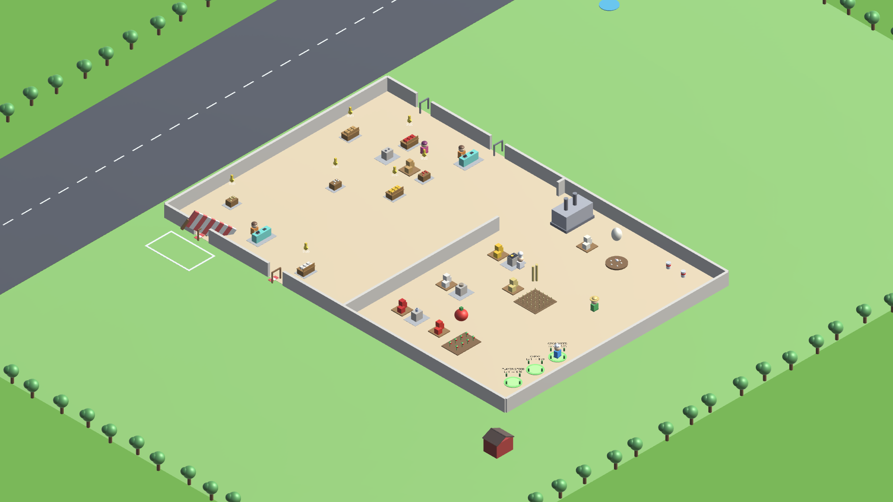
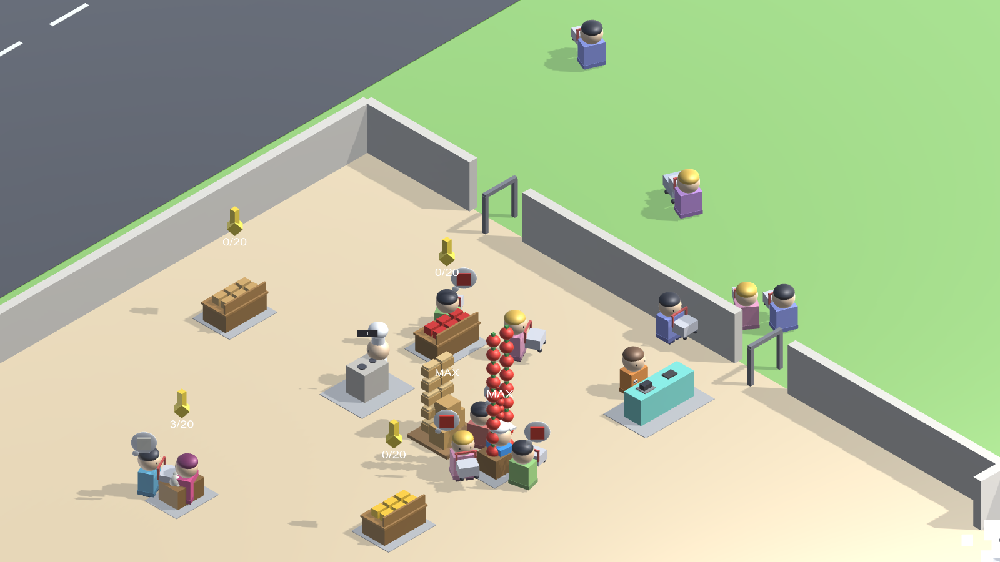
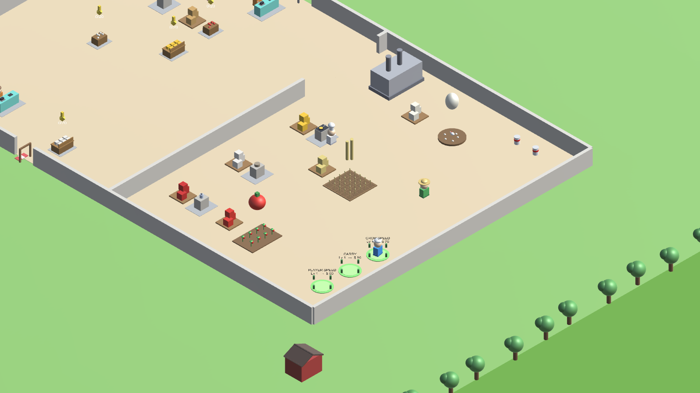

<div align="center">

# 🛒 Mini Mart

**A mobile idle / tycoon store-management game, built in Unity.**

Grow crops → process them into goods → stock the shelves → serve customers →
reinvest the profit → grow from a tiny mini mart into a two-store empire.



*The whole store in one enclosed building: shop floor up top, farm & processing yard below.*

`Unity 6` · `C#` · `Built-in Render Pipeline` · `iOS` · **Solo project**

</div>

---

## 🎮 What it is

Mini Mart is a **phone-first idle tycoon**, in the spirit of *My Mini Mart*. There's no
menu-clicking economy sim here — you physically run the shop: harvest tomatoes, carry
them to the blender, stock the ketchup on a shelf, and grab the cash a customer drops
at the till. Then you hire someone to do it for you, and go find the next bottleneck.

### The loop

```
   Harvest crop ──► Carry to machine ──► Process ──► Stock shelf
        ▲                                                │
        │                                                ▼
   Reinvest ◄── Collect cash ◄── Customer pays ◄── Customer buys
```

Everything you buy accelerates that loop — and every worker you hire takes one leg of
it off your hands.

---

## 📸 Screenshots

| Shop floor — customers, tills, shelves | Farm & processing yard |
|:--:|:--:|
|  |  |
| Buyers browse with trolleys and thought-bubbles, queue at the till, and pay. Workers carry real item stacks above their heads. | Crops, machines and the player-upgrade pads — all inside the walls, a short hop from field → machine → shelf. |

---

## ✨ Features

**Simulation**
- 🌱 **Full production chains** — Tomato→Ketchup, Wheat→Flour→Bread, Egg→Fried Egg, and
  in the second store Milk→Bottled Milk, Corn, Herb, Cheese, Apple, Coffee.
- 🧑‍🌾 **Autonomous workers** — farmer, chef, shelvers and cashiers each own a leg of the
  loop and keep working while you're busy elsewhere.
- 🛍️ **Customers with personality** — they browse, get impatient, queue, pay and leave.
  Some of them shoplift, and you can chase them down with a net.
- 📞 **Phone orders** — a delivery van pulls up with a bulk order for a cash bonus.
- 💤 **Offline earnings** — the store keeps trading while you're away.

**Progression**
- 📈 **10 store levels**, each revealing only **1–3 new things** — deliberate, calm pacing.
- 🏪 **Two stores** — unlock a travel pad and drive to your larger MegaMart: a separate
  scene with its own production chains.
- ⬆️ **Upgrades that actually matter** — you start able to carry only 8 items. You *feel*
  that limit, and every Carry / Speed / Crop-Speed upgrade is a real relief.

---

## 🛠️ Engineering highlights

### Navigation — nav mesh + A\* + steering
Workers used to turn in hard 90° corners, because A\* ran directly over grid cells with
**4-way neighbours** — it could only ever produce a Manhattan staircase. Rebuilt as a
proper three-layer system:

1. **Nav-mesh bake** — the walkability grid is merged into a small set of **convex
   walkable polygons** (greedy maximal-rectangle decomposition). *8,200 grid cells
   collapse into 11 polygons*, linked by portals.
2. **A\* + funnel** — A\* runs over that tiny polygon graph, then the corridor is
   string-pulled with the **Simple Stupid Funnel Algorithm** to recover the true
   shortest path through it — real diagonals that hug corners, not cell-centre zig-zags.
3. **Steering** — agents follow the path with **Reynolds behaviours**: seek, arrival
   (ease into the goal, no jitter), flee, separation (workers flow around one another)
   and look-ahead obstacle avoidance. Forces accumulate into a velocity, so characters
   carry momentum and bank into turns instead of snapping to a new heading.

### Everything is built from code
There is no hand-placed scene. Each scene holds a single `_Bootstrap` object; the entire
world — ground, walls, farms, machines, shelves, characters and the whole HUD — is
generated at runtime by `SceneBootstrapper.cs` and `PrimitiveFactory.cs`. Every mesh is
a primitive; there are **no imported art assets**. That let the game design iterate
without ever waiting on an art pipeline.

### A 45,000-assertion validator
`DataValidator` runs **~45,000 assertions on every boot** — pricing, upgrade curves, the
unlock ladder, storage caps, save/load round-trips, economy permutations. A balance
change that breaks an invariant fails loudly at play time, not in a player's hands.

### An automated tester that plays honestly
`TesterBot` plays the whole game with **player-legal inputs only** — tap-to-move, standing
on pads, proximity interactions. It never teleports or grants itself cash. It runs
L1→L10, buys upgrades like a real player, and writes a timestamped diary. It has caught
bugs no code review would have: a store whose only checkout was locked behind a level you
couldn't reach, a product with no shelf to go on, and an economy that quietly stalled.

---

## 🧱 Tech

| | |
|---|---|
| **Engine** | Unity `6000.5.1f1`, **Built-in Render Pipeline** |
| **Language** | C# |
| **Target** | iOS · portrait · touch |
| **UI** | uGUI + TextMeshPro — built entirely from code |
| **Art** | 100% runtime-generated primitives (no imported models) |
| **Save** | JSON via `PlayerPrefs`, with offline-earnings catch-up |
| **Dependencies** | Essentially none — no third-party pathfinding, tweening or UI kit |

---

## 🚀 Running it

```bash
git clone https://github.com/prit0899/MiniMart.git
```

1. Open the project in **Unity 6000.5.1f1**.
2. Open `Assets/Game.unity`.
3. Press **Play** — the entire world builds itself.

> ℹ️ The scenes are **code-built**: `_Bootstrap` is the only object in them. To change
> the map, edit `SceneBootstrapper.cs`, not the scene.

### Automated playtest

```bash
touch Logs/testerbot.enabled     # spawn the bot when you press Play
touch Logs/testerbot.freshrun    # (optional) wipe the save first
tail -f Logs/testerbot_run.txt   # watch it play
```

---

## 📚 Documentation

| | |
|---|---|
| [PRD.md](Docs/PRD.md) | What we're building, for whom, and the design rules |
| [Architecture.md](Docs/Architecture.md) | Tech stack, code-built-scene model, folder map, invariants |
| [Rules.md](Docs/Rules.md) | Engineering guardrails and boundaries for AI agents |
| [Phases.md](Docs/Phases.md) | Project phases and real status |
| [Design.md](Docs/Design.md) | Palette, item colours, lighting, typography |
| [Memory.md](Docs/Memory.md) | **Live state** — what's done, and every bug found by playing |

---

<div align="center">

Built by [**@prit0899**](https://github.com/prit0899)

</div>
